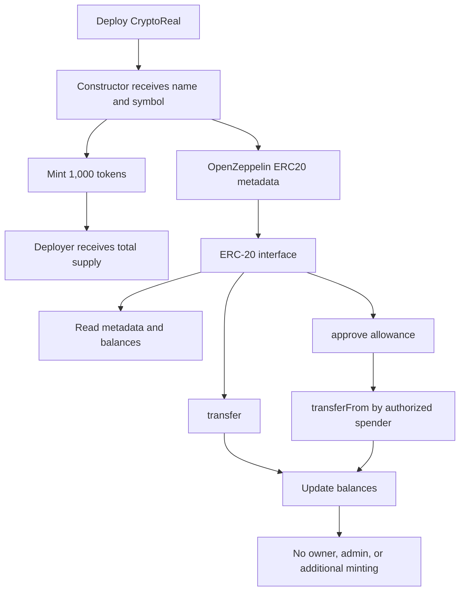

# CryptoReal Token


A portfolio project that demonstrates how to build a compact ERC-20 token with Solidity and OpenZeppelin. It focuses on token creation, standard wallet transfers, and allowance-based spending through a deliberately small and easy-to-review contract.

> Educational project: this repository is intended for learning and local experimentation. It has not been audited and should not be treated as a production financial product.

## Project Highlights

- Implements the ERC-20 standard by extending OpenZeppelin's battle-tested `ERC20` contract.
- Accepts the token name and symbol as deployment parameters.
- Mints a fixed supply of 1,000 tokens to the deployer's address during construction.
- Keeps the permission model intentionally minimal: there is no owner, admin role, or post-deployment minting function.

## Portfolio Context

This project demonstrates:

- Solidity contract structure, inheritance, constructors, and token supply accounting.
- Practical use of OpenZeppelin's ERC-20 implementation instead of reimplementing a token standard from scratch.
- Understanding of direct transfers, allowances, and delegated transfers with `transferFrom`.
- Clear technical documentation, deployment steps, and explicit security limitations.

The current scope is intentionally focused on the token contract. Automated tests and deployment scripts are planned as future improvements.

## Technical Summary

| Item | Details |
| --- | --- |
| Contract | `CryptoReal` |
| Token standard | ERC-20 |
| Solidity | `^0.8.24` |
| Initial supply | `1,000` tokens |
| Decimals | `18` (provided by OpenZeppelin) |
| Initial recipient | `msg.sender` |
| Dependency | `@openzeppelin/contracts` |
| Development tool | [Remix IDE](https://remix.ethereum.org/) |

## Repository Structure

```text
.
├── README.md
└── ERC-2O Token/
    └── CryptoReal.sol
```

## How It Works

At deployment, the constructor forwards the chosen name and symbol to OpenZeppelin's ERC-20 implementation and mints the initial supply to the deployer:

```solidity
constructor(string memory name_, string memory symbol_)
    ERC20(name_, symbol_)
{
    _mint(msg.sender, 1000 * 1e18);
}
```

The value `1e18` represents the contract's 18 decimal places. As a result, the deployer receives `1,000` display tokens, represented internally as `1,000 * 10^18` base units.

The constructor does not accept an initial supply argument. Every deployment creates exactly `1,000` tokens, and the full supply is assigned to the wallet that deploys the contract.

## Conceptual Map



The map shows the main relationship: deployment creates the fixed supply, while the inherited ERC-20 interface handles reading balances, direct transfers, and delegated transfers through allowances.

## ERC-20 Interface

The contract inherits the standard metadata, balance, transfer, and allowance functionality from OpenZeppelin:

- `name()` and `symbol()`
- `decimals()` and `totalSupply()`
- `balanceOf(address)`
- `transfer(address, uint256)`
- `approve(address, uint256)`
- `allowance(address, address)`
- `transferFrom(address, address, uint256)`

### Allowance Example

An owner can authorize a spender to move tokens on their behalf:

1. The owner calls `approve(spender, amount)`.
2. The spender calls `transferFrom(owner, recipient, amount)`.
3. The allowance decreases as tokens are transferred, following OpenZeppelin's ERC-20 implementation.

Amounts passed to contract functions use base units. For example, transferring `2` display tokens requires `2 * 10^18` as the `uint256` amount.

## Deployment With Remix

1. Open [Remix IDE](https://remix.ethereum.org/).
2. Create `CryptoReal.sol` and copy the source from [`ERC-2O Token/CryptoReal.sol`](ERC-2O%20Token/CryptoReal.sol).
3. Make the `@openzeppelin/contracts` dependency available in the Remix workspace. Remix can resolve the import from its package manager or from an imported OpenZeppelin source.
4. Compile with a compatible Solidity compiler version, such as `0.8.24`.
5. Open **Deploy & Run Transactions** and select **Remix VM** for local testing or **Injected Provider** for a connected wallet.
6. Provide a token name and symbol, for example `Crypto Real` and `CRL`.
7. Deploy the contract and interact with the inherited ERC-20 functions.

### Example Parameters

```text
Name: Crypto Real
Symbol: CRL
Initial supply: 1,000 CRL
```

## Scope and Limitations

This is a focused educational project and is not presented as a production-ready financial product. The contract does not include:

- Additional minting or burning controls
- Ownership or administrative roles
- Pausing, blacklisting, fees, or transfer taxes
- Upgradeability

The repository currently contains only the contract source and documentation. It does not include an automated test suite, deployment script, owner controls, or a token recovery mechanism. Review and test the code independently before deploying it to a public network.

## Security Notes

- The deployer receives the entire initial supply, so the deployment account must be trusted by token users.
- There is no admin account capable of changing balances or creating more tokens after deployment.
- Sending tokens to the token contract address or an incorrect address may make them unrecoverable.
- Use a local Remix VM while learning and test all transfer and allowance flows before connecting a wallet to a public network.

## License

The contract is released under the `LGPL-3.0-only` license, as declared by its SPDX identifier.
